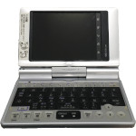

# Zaurus SL-C700

  
|Component|Description                 |
|---------|----------------------------|
|CPU      |Intel XScale PXA250 400MHz  |
|RAM      |32MB                        |
|Flash    |64MB                        |
|Screen   |3.7" 640x480 Resistive Touch|
|Slot     |SDCard, CFCard              |
|Kayboard |5 rows keypad               |
|Battery  |3.7V 950mA                  |
|Dimension|120mm x 83mm x 18.6mm       |
|Weight   |225g                        |

### https://steward-fu.github.io/website/index.htm
